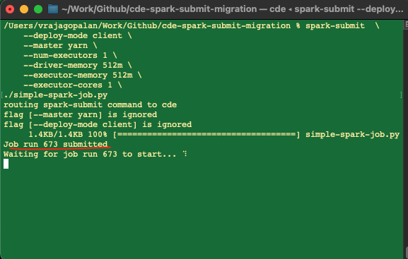
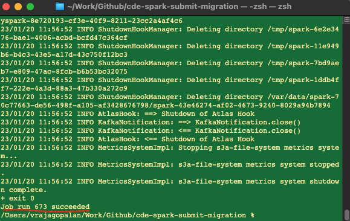

# CDE spark-submit MIGRATION TOOL Demo : Public Cloud only

Cloudera Data Engineering (CDE) provides a command line tool that makes migration of spark workloads to CDE a breeze. The key advantage to using this tool is the ability to migrate spark workloads to CDE without a rewrite of the spark-submit command lines. 
        While this tool works on both Public and private form factors, this example is specific for running a spark-submit workload on **Public Cloud CDE Cluster only** 

<br>

## Pre-requisites
- This set up will only work on a Mac notebook 
- You have access to Cloudera Data Platform( CDP), Cloudera Data Engineering (CDE) Virtual Cluster 
- You have successfully setup cde command line tool. If you have not done so already, please refer to  cloudera documentation [here](https://docs.cloudera.com/data-engineering/cloud/cli-access/topics/cde-cli.html)
- Access keys for CDP. Click [here](https://docs.cloudera.com/cdp-public-cloud/cloud/cli/topics/mc-cli-generating-an-api-access-key.html) for more help documentation
- A basic knowledge of executing Spark jobs remotely using command line tools. 

## Step 1: Setup of CDE spark-submit Migration Tool 
- clone the repo in a folder on your mac. You have multiple ways to do this: 
    1)  If you are familiar with git command line  following command line <br>
`git clone https://github.com/SuperEllipse/cde-spark-submit-migration`
    2) You can also directly go to the git location [here](https://github.com/SuperEllipse/cde-spark-submit-migration) and download it as a zip and unzip it, although the method 1 is preferable. 
- go to the directory cde-env-tool <br>
`cd /your/path/install-for-mac/cde-env-tool`
- Install the tool and run the following command to ensure that you can run the tool without root permissions on your laptop<br>
`sed -i '' "s#CLOUDERA_BIN=/opt/cloudera/bin#CLOUDERA_BIN=$HOME/bin#g" cde-env.sh && ./cde-env.sh enable-spark-submit-proxy -f private`
- Update PATH to give access to those binary and script files. <br>
`export PATH=$HOME/bin:$PATH`
- Check if the tool is installed with the following command <br>
`which cde-env.sh` <br>
The result should show you <br> 
`$HOME/bin/cde-env.sh` <br>
where $HOME is your home directory on your Laptop,  in my case, the result is as below since my HOME directory is /Users/vrajagopalan, your ouput could be different based on your home directory location<br>
`/Users/vrajagopalan/bin/cde-env.sh`
- Ensure that your which command above succeeds, else the tool set up has not been succesfull and the rest of the steps won't work.

## Step 2: Configuring the CDE spark-submit Migration Tool 
**Important Note:** To configure the spark-submit migration tool we need to modify the config.yaml file of the CDE CLI tool. Internally the CDE spark-submit migration tool uses CDE CLI interface so it is essential that the CDE CLI tool be set up. <br><br>
1) Copy the following URL for the CDP Environment your are planning to use  in a Textedit application on your mac. For example below image describes how to get the CDP End point <br>

2) Copy the following URL for the Virtual Cluster endpoint  in a Textedit application on your mac. For example below image describes how to get the Virtual Cluster endpoint<br>

3) Copy the full path location access Credentials file location for CDP ( refer to the step in pre-requisites)
4) Launch Terminal on macbook and change to .cde directory <br> 
`cd $HOME/.cde`
5) next open config.yaml file and change the contents to following
```
# ~/.cde/config.yaml 
allow-all-spark-submit-flags: true 
credentials-file: <credentials-location>
cdp-endpoint: <CDP-endpoint>
tls-insecure: true
profiles:
- name: vc-1 #enter a profile name you wish for but then you need to activate this later   vcluster-endpoint: <VC-endpoint>
```
Enter the cdp credentials-location, cdp-endpoint, and virtual cluster endpoint. <br>
An example of this file looks like below: <br>


## Step 3: Executing Spark Submit Commands 
In this step we will activate the user profile that we have created and then submit a simple-spark-job to CDE with the spark-submit command that we familiar with for submitting spark jobs. In this case, behind the scenes, the spark-submit commands with redirected to the CDE cluster. To get started , let us activate the profile we created earlier ( if you have not used vc-1 then change it to the profile name you have used instead of vc-1) <br> 
- First navigate to the folder where you have installed this demo by 
`cd /path/to/this-demo-on-your-mach/`
- Ensure that you are able to see the folder structure below <br>

- We now need to activate the profile we created earlier in our config.yaml file. To do so, execute the command below <br>
` cde-env.sh activate -p vc-1`  <br>
- Now we are ready to execute the spark-submit command on our virtual cluster using our simple-spark-job.py file. This simply calculates the value of pi function as a spark job.
'''
spark-submit  \
    --deploy-mode client \
    --master yarn \
    --num-executors 1 \
    --driver-memory 512m \
    --executor-memory 512m \
    --executor-cores 1 \
./simple-spark-job.py
'''
<br> 
<br> 
You should now see a job submitted to your spark cluster, with the image below. 

When you wait for a little while, you should be able to see that the spark job has completed as below:


## Step 4 : Validating Spark Submit command 
In order to validate if our spark-submit did execute , we go to CDE and check the submitted jobs. Go to cloudera data engineering in CDP and click on Job Runs menu option on the right. You may also need to change the Virtual cluster to the one you have used for submitting your spark wokload. your spark-submit should have executed with the job cli-submit-<username>-XXXXXXXXXX. See example screen shot below.<br>
 

## Step 5 : Validating the job Output. 
Click on the Job Run id, and open the Logs. Clicking on the stdout shows the output of our submitted spark job <br> 
 

## Summary: 

With this demo, we demonstrate how the spark-submit migration tool  cane be used to migrate existing spark workloads to CDE without changes to spark-submit commands. Although, we have used a public cloud example to demonstrate this here, the tool can be  used equally effectively on a private cloud SPARK workloads. More details can be found in the documentation [here](https://docs-stage.cloudera.com/data-engineering/1.5.0/cde-spark-submit-migration/topics/cde-use-env.html) (Note: Documentation is currently under review , subject to changes and not hence published externally). The spark-submit migration tool can also be configured for multiple profiles, so that the spark workloads are executed against different virtual clusters. 